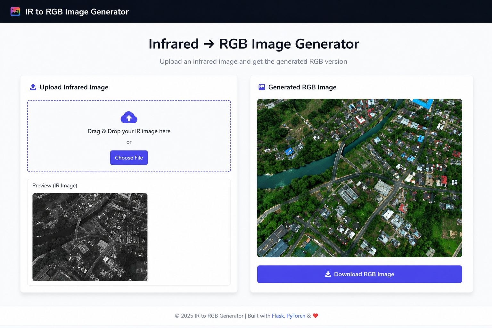

# 🚀 IR to RGB Image Generator



Convert infrared satellite images into realistic RGB representations using **Pix2Pix GAN**, **U-Net Generator**, and **PatchGAN Discriminator**.

---

## 🔴 Key Features

🔴 **Infrared to RGB Translation**

* Converts grayscale/IR satellite images into realistic RGB outputs.

🔴 **Pix2Pix GAN Architecture**

* Uses a U-Net Generator with skip connections and a PatchGAN Discriminator.

🔴 **Interactive Web Interface**

* Drag-and-drop image upload with live preview.

🔴 **One-Click Download**

* Download generated RGB images instantly.

🔴 **Real-Time Processing**

* Displays progress indicators during preprocessing and inference.

🔴 **Responsive Design**

* Works seamlessly on desktop and mobile devices.

🔴 **Performance Metrics**

* Shows PSNR, SSIM, and inference time after generation.

---

## 🔵 Technology Stack

🔵 **Frontend**

* HTML5
* CSS3
* JavaScript

🔵 **Backend**

* Flask
* Python

🔵 **Deep Learning**

* PyTorch
* Pix2Pix GAN
* U-Net Generator
* PatchGAN Discriminator

🔵 **Image Processing**

* Pillow (PIL)
* Torchvision

---

## 🔴 System Workflow

```text
Upload IR Image
        ↓
Image.open().convert("L")
        ↓
Resize (256 × 256)
        ↓
ToTensor()
        ↓
U-Net Generator
        ↓
PatchGAN Validation
        ↓
RGB Image Generation
        ↓
Download Output
```

---

## 🔵 Model Architecture

### Generator (U-Net)

🔵 Encoder-Decoder architecture with skip connections.

🔵 Preserves spatial information during reconstruction.

🔵 Produces realistic RGB images from IR inputs.

### Discriminator (PatchGAN)

🔵 Evaluates local image patches instead of the entire image.

🔵 Encourages sharper textures and fine details.

🔵 Improves visual realism of generated outputs.

---

## 🔴 Training Configuration

```text
Optimizer        : Adam
Learning Rate    : 0.0002
Beta Values      : (0.5, 0.999)
Batch Size       : 8
Epochs           : 10
Image Size       : 256 × 256
Loss Function    : BCEWithLogitsLoss + L1Loss
Generator Loss   : GAN Loss + 100 × L1 Loss
```

---

## 🔵 Performance Metrics

| Metric         | Value       |
| -------------- | ----------- |
| PSNR           | 28–38 dB    |
| SSIM           | 0.75–0.96   |
| Inference Time | 0.3–2.5 sec |

---

## 🔴 Applications

🔴 Environmental Monitoring

🔴 Land Use Classification

🔴 Urban Planning

🔴 Agricultural Analysis

🔴 Remote Sensing Research

🔴 Disaster Management

🔴 Geospatial Intelligence

---

## 🔵 Project Structure

```text
IR-to-RGB-Generator/
│
├── app.py
├── models/
│   ├── generator.py
│   └── discriminator.py
│
├── checkpoints/
│   └── generator.pth
│
├── templates/
│   └── index.html
│
├── static/
│   ├── style.css
│   └── script.js
│
├── outputs/
│   └── result.png
│
└── requirements.txt
```

---

## 🔴 Installation

```bash
git clone https://github.com/your-username/IR-to-RGB-Generator.git

cd IR-to-RGB-Generator

pip install -r requirements.txt

python app.py
```

---

## 🔵 Open in Browser

```text
https://velvety-salamander-f97de2.netlify.app/
```

---

## 🔴 Future Improvements

🔴 Higher-resolution image generation.

🔴 Real-time GPU acceleration.

🔴 Support for multispectral satellite imagery.

🔴 Integration with cloud deployment platforms.

🔴 Improved color fidelity using larger datasets.

---

## ❤️ Built With

🔵 Flask
🔵 PyTorch
🔵 Pix2Pix GAN
🔵 U-Net Generator
🔵 PatchGAN Discriminator
🔵 HTML, CSS & JavaScript

**© 2025 IR to RGB Image Generator**
